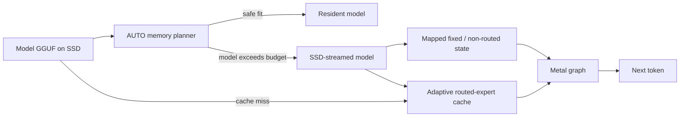

<h1 align="center">DwarfStar</h1>

<p align="center"><strong>Specialized local inference for models that do not fit in memory.</strong></p>

<p align="center">
  A transparent research and co-development fork of
  <a href="https://github.com/antirez/ds4">antirez/ds4</a>, focused on Metal,
  adaptive SSD streaming, common 16–64 GB Apple Silicon systems, and measured experimentation.
</p>

<p align="center">
  <a href="LICENSE"></a>
  
  
  
  
</p>

<p align="center">
  <a href="#quick-start"><strong>Quick start</strong></a>
  · <a href="#measured-results">Benchmarks</a>
  · <a href="#model-status">Models</a>
  · <a href="https://github.com/andreaborio/dsbox">DSBox</a>
  · <a href="https://github.com/antirez/ds4/compare/main...andreaborio:ds4:main">Upstream diff</a>
  · <a href="#documentation">Documentation</a>
</p>

> [!IMPORTANT]
> This is `tmzt/ds4` a fork of a fork which adds a new INFER protocol based on the
> distributed protocol. It enables explicit support for caching a conversation or
> system prompt prefix and returns a hash of the combined prompt which can be tracked.
> 
> This is documented in [INFER](./INFER_PROTOCOL.md).

> [!IMPORTANT]
> This is [`andreaborio/ds4`](https://github.com/andreaborio/ds4), a fork of
> [`antirez/ds4`](https://github.com/antirez/ds4). It does **not** aim to replace
> upstream. The goal is to co-develop DwarfStar: explore complementary hardware
> and model paths here, then propose every general, reproducible improvement back
> to upstream when it clears the correctness and performance bar.

DwarfStar is a small, self-contained inference engine optimized around a narrow
set of very large models. It includes native model loading, prompt rendering,
tool calling, RAM/on-disk KV state, an HTTP server, a coding agent, GGUF tooling,
and correctness and speed tests. It is intentionally **not** a generic GGUF
runner; arbitrary GGUF files are not expected to work.

## Why this fork exists

Upstream DwarfStar provides the core engine and leads the high-memory and
distributed paths. This fork asks a complementary question:

**How far can the same specialized design be pushed on the 16–64 GB Macs many
developers already own, when the SSD becomes an active model-memory tier?**

The current work concentrates on:

- adaptive Metal residency and routed-expert cache policies across memory tiers;
- SSD streaming that accounts for page cache, wired memory, swap, I/O, and
  throughput together;
- safer model-backed experiments near macOS memory limits;
- measured GLM 5.2 work and Qwen3.6-35B-A3B bring-up;
- GGUF calibration, incremental quantization, and expert-analysis tooling;
- keeping useful changes small enough to validate and send upstream.

This is primarily a learning and systems-research project. The fork lets work
continue while upstream changes are under review; it is not a parallel rewrite
or a competing inference ecosystem.

## Co-development with upstream

The boundary is explicit and reviewable:

| Change type | Where it belongs |
| --- | --- |
| General, reproducible, backend-safe improvement | Open a PR against [`antirez/ds4`](https://github.com/antirez/ds4) |
| Model- or hardware-specific experiment | Keep it isolated while evidence is incomplete; open an upstream PR too whenever it applies to an upstream-supported path |
| Change that regresses an existing path | Do not promote it; isolate or revise it first |
| Change already solved upstream | Take the upstream implementation and remove the fork delta |

This is mandatory, not aspirational: every fork change applicable to an
upstream-supported path will be opened upstream once its scope, correctness,
and performance evidence are ready. Fork development can continue while that
review is in progress.

Current upstream work includes [#434](https://github.com/antirez/ds4/pull/434)
(quality-score build fix), [#520](https://github.com/antirez/ds4/pull/520)
(GLM streamed-prefill correctness), and
[#528](https://github.com/antirez/ds4/pull/528) (GLM indexed-prefill prepare).
The DeepSeek regression found on the GLM line is tracked in
[#532](https://github.com/antirez/ds4/issues/532). See
[`FORK_NOTES.md`](FORK_NOTES.md) for the status of each fork change and
[`MERGE_LOG.md`](MERGE_LOG.md) for sync history. The same policy is part of
[`CONTRIBUTING.md`](CONTRIBUTING.md). The current `main` delta is always
inspectable in GitHub's
[upstream/fork comparison](https://github.com/antirez/ds4/compare/main...andreaborio:ds4:main).

## Quick start

Requirements: Apple Silicon, Xcode Command Line Tools, and enough SSD space for
the selected model. A 64 GB Mac is the practical reference tier for DeepSeek
Flash streaming; the 16 GB path is an experimental low-memory tier, not a speed
guarantee.

```sh
xcode-select --install
git clone https://github.com/andreaborio/ds4.git
cd ds4

./download_model.sh q2-imatrix
make
./ds4 --build-info
./ds4 -m ./ds4flash.gguf --nothink
```

On macOS, AUTO residency keeps the model resident when it safely fits.
Otherwise it selects SSD streaming and derives an expert-cache budget from the
model geometry and live host memory. Force the SSD path only when you need a
controlled run:

```sh
./ds4 -m ./ds4flash.gguf --ssd-streaming --ctx 32768 --nothink
```

Start the local API with:

```sh
./ds4-server -m ./ds4flash.gguf --ctx 32768
```

## How SSD streaming uses memory



The fixed model state, KV cache, graph scratch, and macOS file-backed cache all
need headroom. The routed-expert cache is the variable tier; making it larger
can help only until it starts displacing the pages and allocations the rest of
the runtime needs.

## Model status

| Model | Location | Status | Current focus |
| --- | --- | --- | --- |
| DeepSeek V4 Flash | `main` | Primary supported path | Metal, adaptive SSD streaming, 16–64 GB measurements |
| DeepSeek V4 PRO | `main` | Supported upstream path | High-memory and distributed inference |
| GLM 5.2 | `codex/glm52-upstream-clean-bench` | Experimental branch | Correct streamed prefill and Metal performance on 64 GB |
| Qwen3.6-35B-A3B (`qwen35moe`) | `main` | Supported opt-in Metal path, model-backed measured | Metal AUTO mapping, live-pressure fallback, strict SSD cache, resident prefill, and parallel resident decode |

### DeepSeek expert-major v2 format

DS4 includes the experimental, self-describing `ds4.expert_major.v2` layout for
DeepSeek V4. It stores each layer as adjacent gate/up/down expert records without
requantizing and without keeping a second routed-weight copy. Canonical GGUFs
remain byte-for-byte compatible with every existing backend; native v2 files
currently require a complete local Apple Metal model and fail early elsewhere.

Conversion, full byte-level verification, compatibility limits, and the
model-backed promotion gate are in
[`docs/deepseek-expert-major-v2.md`](docs/deepseek-expert-major-v2.md). Until a
dated canonical/native benchmark gate is complete, the canonical DeepSeek GGUF
remains the release reference. The first M5 Pro SSD tranche is recorded in
[`docs/benchmarks/2026-07-17-deepseek-native-expert-major.md`](docs/benchmarks/2026-07-17-deepseek-native-expert-major.md).
The distinctly named experimental artifact is
[`DeepSeek-V4-Flash-DS4-ExpertMajor-v2-GGUF`](https://huggingface.co/andreaborio/DeepSeek-V4-Flash-DS4-ExpertMajor-v2-GGUF),
with full conversion provenance and compatibility limits in its model card.

### Qwen3.6 Metal AUTO path

The main branch is qualified and measured with one normalized text-only
artifact. The recommended release download is the single-layout
`Qwen3.6-35B-A3B-DS4-ExpertMajor-v1-Q4_K_S.gguf` from
[`andreaborio/Qwen3.6-35B-A3B-DS4-ExpertMajor-v1-GGUF`](https://huggingface.co/andreaborio/Qwen3.6-35B-A3B-DS4-ExpertMajor-v1-GGUF).
It stores routed weights once in DS4's expert-major order and activates
automatically; no sidecar variables are needed. The canonical
`Qwen3.6-35B-A3B-ds4-Q4_K_S.gguf` remains supported during migration.
The release artifact is 20,808,970,240 bytes (only 406,816 bytes larger than
the canonical input) with SHA-256
`fb2b344d49f0c3dfd854cfc11d92ffc873cc93a1d30bf4664e5aea6f1bfef839`.

This is not generic Qwen or arbitrary community-GGUF support. The literal
environment guard is the experimental opt-in; Metal, power 100, and AUTO
residency are the Apple defaults, but are shown below for reproducibility:

```sh
DS4_QWEN_EXPERIMENTAL_METAL=1 ./ds4 \
  -m /absolute/path/to/Qwen3.6-35B-A3B-DS4-ExpertMajor-v1-Q4_K_S.gguf \
  --metal --power 100 --ctx 8192 --nothink
```

`ds4.expert_major.v1` is an explicit DS4 GGUF extension. Other loaders must
reject this artifact unless they implement the layout; use the canonical file
for llama.cpp, MLX, or other runtimes. Format details, conversion commands,
compatibility boundaries, and measured parity are in
[`docs/qwen-expert-major-store.md`](docs/qwen-expert-major-store.md).

Qwen AUTO selects the full-model mapped Metal mode only when both the fixed Metal
working-set budget and a point-in-time host-memory pressure check pass. Under
pressure it falls back to SSD and lazily grows the routed-expert cache to the
largest complete routing tier admitted by the current conservative snapshot.
Above 16 GiB the planner independently reserves the 2.50 GiB static page set,
context/runtime memory, and system headroom. On a 16 GiB Mac, AUTO keeps the
complete static charge but lets those unpinned, pageable GGUF pages share system
headroom. It selects the largest complete 320-expert cache cycle admitted by
the remaining live and platform budgets rather than imposing a fixed low-RAM
floor. Bounded file-backed inactive pages receive full credit only while macOS
reports normal pressure; unknown or elevated pressure retains half-credit and
fails closed near the boundary. `--resident` fails unless both admission checks
pass; because pressure can change after the
snapshot, this is a conservative admission policy rather than a future-memory
guarantee. `--ssd-streaming` remains the reproducible forced-streaming override.
In SSD mode Qwen grows its Metal expert cache in 321-expert slabs (about
0.529 GiB) instead of taking the generic 4 GiB first slab.

Here `resident` means that DS4 maps the complete tensor payload, disables its
explicit SSD expert cache, and executes full-tensor Metal kernels. Metal's
residency request is a budgeting hint: it neither pre-faults every GGUF page nor
proves that every page remains physically resident as later pressure changes.
That stronger physical-residency claim requires separate runtime measurement.
All neural math in the supported Qwen path is on Metal. The CPU still performs
tokenization, sampling, route readback, cache bookkeeping, and streamed GGUF
I/O; a CPU+GPU split of layers or experts is not implemented in this path.

The hard SSD cache floor is 321 complete routed experts (about 0.53 GiB); 640
(about 1.06 GiB) is a useful controlled small-cache tier. Startup and the
per-layer path fail closed if the effective locked cache falls below the floor.
The runtime has completed model-backed resident and SSD generation on an M5 Pro
with 64 GiB, plus bounded SSD generation on a physical M1 Pro with 16 GiB. On
production main `bd62a0b`, AUTO started with 321 cached experts for prefill and
grew toward 2,241 for decode. One cold request completed at 10.56/8.24
prefill/generation t/s; four subsequent distinct short prompts had medians of
15.04/9.77 t/s, with normal memory pressure and no new swapouts. This recheck
used the canonical migration GGUF; the native ExpertMajor v1 artifact was not
copied to the 16 GiB host because only 3.6 GB of disk space was free. The older
4.06/7.03 result remains a conservative 321-expert compatibility floor, not the
current production speed. See
[`tests/qwen/README.md`](tests/qwen/README.md) for the exact artifact contract,
reproducible evidence, and current limitations.

Metal on Apple Silicon is the current proving ground for fork-specific
optimization. The inherited CUDA/DGX Spark and ROCm/Strix Halo DeepSeek paths
remain supported targets, but a Metal result is not advertised as a Blackwell
or Strix Halo result until it is re-measured on that backend.

## Measured results

Best retained local results so far. These rows are not cross-model rankings:
each model uses a different artifact, context, and runtime path.

| Model | Best measured setup | Prefill | Generation / decode | Status |
| --- | --- | ---: | ---: | --- |
| Qwen3.6-35B-A3B Q4_K_S, 20.81 GB | M5 Pro 64 GB, Metal resident | **258.08 t/s** | 57.81 t/s | Controlled DS4 prefill A/B, +23.3% over the previous dispatch; greedy output identical |
| Qwen3.6-35B-A3B Q4_K_S, 20.81 GB | M5 Pro 64 GB, page-touched resident CLI | 218.30 t/s | **63.94 t/s** | Best retained real CLI generation number; same rendered prompt and visible continuation as the llama.cpp reference |
| Qwen3.6-35B-A3B Q4_K_S, 20.81 GB | M1 Pro 16 GB, Metal AUTO to SSD, canonical migration GGUF | **15.04 t/s** | **9.77 t/s** | Warm median over four distinct short prompts after one cold run; normal pressure, no new swapouts |
| DeepSeek V4 Flash IQ2XXS, 86.72 GB | M5 Pro 64 GB, Metal SSD streaming | 20.75 t/s | 12.58 t/s | Direct upstream/fork A/B showed parity, not a fork speedup |
| GLM 5.2 ds4-native GGUF, 244.14 GiB | M5 Pro 64 GB, Metal SSD streaming | **9.15 t/s** | 0.91 t/s | Indexed-prefill prepare A/B; big prefill win, no decode win |

DeepSeek hardware reference bests from the standard `speed-bench` sweep:

| Host | Model | Prefill | Generation |
| --- | --- | ---: | ---: |
| MacBook Pro M5 Max, 128 GB | Flash q2, 11,707-token context | 463.44 t/s | 25.90 t/s |
| Mac Studio M3 Ultra, 512 GB | Flash q2, 11,709-token context | 468.03 t/s | 27.39 t/s |
| Mac Studio M3 Ultra, 512 GB | PRO q2, 32,768-token context | 138.82 t/s | 9.56 t/s |
| DGX Spark GB10, 128 GB | Flash q2, 7,047-token context | 343.81 t/s | 13.75 t/s |

Full commands, samples, and caveats are in
[`docs/benchmarks/2026-07-15-qwen-ds4-vs-llamacpp.md`](docs/benchmarks/2026-07-15-qwen-ds4-vs-llamacpp.md),
[`docs/benchmarks/2026-07-14-m5-pro.md`](docs/benchmarks/2026-07-14-m5-pro.md),
[`SSD_STREAMING_VERIFICATION.md`](SSD_STREAMING_VERIFICATION.md), and
[`docs/ENGINE_REFERENCE.md`](docs/ENGINE_REFERENCE.md).

## Memory safety is part of performance

More expert-cache RAM is not automatically faster. On memory-constrained Macs,
an oversized cache can evict the file-backed pages SSD streaming needs and make
decode slower even when Activity Monitor appears to show free memory. AUTO
therefore treats the routed-expert cache as variable and preserves headroom for
fixed weights, KV, scratch, Metal allocations, and the macOS page cache.

During development, a model-backed test bypassed SSD streaming and attempted to
make an 80.76 GiB GGUF resident with a 100,000-token context on a 64 GiB Mac.
Global wired memory reached roughly 61.36 GiB before a watchdog kernel panic.
Crashing the host is not an acceptable test outcome.

Current `main` includes hardware-aware AUTO residency, fail-closed cache
admission, bounded benchmark guards, and GPU cleanup before model mappings are
released (`1523b26`). A stricter guard that rejects resident mappings larger
than 90% of physical RAM is tested and published on
`fix/refuse-oversized-resident-maps` at `06fd005`, but is **not yet on `main`**.
Until it is merged, it must not be described as a mainline guarantee.

## Prefer a desktop interface?

[DSBox](https://github.com/andreaborio/dsbox) is the companion desktop
interface, inspired by Unsloth Studio: discover compatible models, manage ds4,
chat locally, connect coding agents, and observe memory, swap, disk, and token
throughput without hand-assembling every command. DSBox is a separate project
and still a work in progress.

<p align="center">
  <a href="https://github.com/andreaborio/dsbox">
    
  </a>
  <br>
  <sub>DSBox is an optional companion UI, maintained in a separate repository.</sub>
</p>

## Documentation

- [`docs/ENGINE_REFERENCE.md`](docs/ENGINE_REFERENCE.md): complete model,
  runtime, server, agent, KV-cache, distributed, backend, and debugging guide.
- [`tests/qwen/README.md`](tests/qwen/README.md): experimental Qwen artifact
  contract, oracle procedure, Metal + SSD commands, measurements, and limits.
- [`docs/qwen-expert-major-store.md`](docs/qwen-expert-major-store.md):
  DS4-native GGUF layout, transactional converter, compatibility, and parity
  evidence.
- [`docs/expert-major-v2-roadmap.md`](docs/expert-major-v2-roadmap.md): generic
  expert-major manifest and separate DeepSeek/GLM qualification plan.
- [`CONTRIBUTING.md`](CONTRIBUTING.md): upstream-first contribution policy and
  correctness/performance gates.
- [`FORK_NOTES.md`](FORK_NOTES.md): fork delta and upstreamability ledger.
- [`MERGE_LOG.md`](MERGE_LOG.md): upstream synchronization history.
- [`GOLD_METAL_SSD.md`](GOLD_METAL_SSD.md): Metal build identity, AUTO residency,
  and benchmark promotion gates.
- [`SSD_STREAMING_VERIFICATION.md`](SSD_STREAMING_VERIFICATION.md): independent
  SSD-streaming verification campaign.
- [`ONEDGE_IMATRIX.md`](ONEDGE_IMATRIX.md): live, privacy-preserving imatrix
  collection.
- [`STREAMING_MIXED_PRECISION.md`](STREAMING_MIXED_PRECISION.md): mixed-precision
  expert streaming design and validation.
- [`EXPERT_PRUNE.md`](EXPERT_PRUNE.md): expert profiling and prune-mask research.
- [`gguf-tools/README.md`](gguf-tools/README.md): GGUF, imatrix, quantization, and
  quality tooling.

---

<details>
<summary><strong>Detailed fork additions and research notes</strong></summary>

## Fork feature details

The sections below preserve the longer design notes for the fork's research
features. They are not an exhaustive commit count: adaptive residency, cache
hardening, benchmark guardrails, telemetry, and safe Metal teardown have also
evolved since the original five-feature summary was written. The authoritative
per-change ledger is [`FORK_NOTES.md`](FORK_NOTES.md); upstream syncs are recorded
in [`MERGE_LOG.md`](MERGE_LOG.md).

### The GLM 5.2 SSD-streaming line (not mainline)

The fork also carries a GLM 5.2 line on
[`codex/glm52-upstream-clean-bench`](https://github.com/andreaborio/ds4/tree/codex/glm52-upstream-clean-bench):
upstream's `glm5.2` branch (`bd89932`) plus eleven commits — the streaming prefill
correctness fixes proposed as
[antirez/ds4#520](https://github.com/antirez/ds4/pull/520) (real-size prompts were
failing under `--ssd-streaming`; independently validated by a third party on an M4 Max
128 GB), the indexed-prefill layer-prepare overlap proposed as
[antirez/ds4#528](https://github.com/antirez/ds4/pull/528) (measured prefill ×1.6-2.0
across a 2048-8192 sweep in the PR, ×2.4-2.5 re-measured on short prompts, decode
unchanged, greedy output byte-identical), the ds4-native GLM 5.2 GGUF layout support the
line runs on, a copy of the RAM guard (upstreamed separately, see
[`FORK_NOTES.md`](FORK_NOTES.md)), and a set of default-off streaming experiments
(router-ahead prefetch, expert prune/profile hooks, virtual resident decode layers).
The short-prompt speedup, the regression below and the MTP gate were re-verified
independently with paired A/B runs
([`SSD_STREAMING_VERIFICATION.md`](SSD_STREAMING_VERIFICATION.md)); the sweep figures
are from [#528](https://github.com/antirez/ds4/pull/528)'s benchmark.

Two caveats, both measured:

- **Upstream's whole `glm5.2` line decodes DeepSeek Flash ~2.8× slower than `main`**
  (DeepSeek-V4-Flash IQ2XXS: 7-8 → ~2-3 tok/s on an M5 Pro 64 GB under
  `--ssd-streaming`, first token ~5-7 s; bisected to the first commit of the line,
  verified twice on separate days). Keep DeepSeek work on `main`; reported upstream as
  [antirez/ds4#532](https://github.com/antirez/ds4/issues/532).
- **Speculative decode (MTP) on streamed GLM is a measured NO-GO**: the `blk.78` nextn
  acceptance probe (branch
  [`feat/glm-mtp-probe`](https://github.com/andreaborio/ds4/tree/feat/glm-mtp-probe),
  a reusable measurement tool; GLM 5.2 ds4-native build) reads ~55% acceptance against
  the ~75% needed to pay for the extra I/O.

The older bring-up branch
[`wip/glm52-metal64-strict-probe`](https://github.com/andreaborio/ds4/tree/wip/glm52-metal64-strict-probe)
predates this line and is kept as history.

### 1. On-edge / real-time imatrix collection: `ds4-server --imatrix-out`

Upstream collects the routed-MoE importance matrix (imatrix) **offline** from a fixed corpus
(`ds4 --imatrix-dataset … --imatrix-out …`). This fork lets **`ds4-server` collect it from the
live prompt stream on the device**, so a quantized model can be **re-calibrated to its actual
workload**, without ever storing a single user prompt. The only artifact is the imatrix:
aggregate per-(layer, expert) activation statistics (squared activations + hit counts), a
structure that cannot hold prompt text.

```sh
ds4-server -m model.gguf --imatrix-out edge.dat                  # collect from live traffic
ds4-server -m model.gguf --imatrix-out edge.dat --imatrix-every 128 --imatrix-min-requests 32
```

Default **off** (zero behavioral change); opt-in via `--imatrix-out`, with periodic snapshots
(`--imatrix-every`) and a minimum-requests guard (`--imatrix-min-requests`). Full design,
wiring, limits and privacy verification in [`ONEDGE_IMATRIX.md`](ONEDGE_IMATRIX.md).

### 2. Incremental re-quantization: `deepseek4-quantize --reuse PRIOR.gguf`

Re-forging a *variant* (say, adding a per-layer Q4 "boost" on top of an IQ2 build that used the
same imatrix) normally regenerates **every** routed-expert tensor from the FP weights, even the
ones that don't change. But quantization is deterministic in (FP weights, target type, imatrix
slice), so an unchanged tensor is **byte-identical** to the one already sitting in a prior
build. Recomputing it is pure waste.

`--reuse PRIOR.gguf` copies a planned output tensor straight from PRIOR when its **name, target
type and shape** match, and quantizes only the tensors that actually changed (the boosted
layers, at their new type).

```sh
# 1. build the 2-bit base once
gguf-tools/deepseek4-quantize --hf FP --template base.gguf --imatrix coder.dat \
  --out coder-iq2.gguf

# 2. every boost variant reuses the base's unchanged layers, re-quantizing only the boosted ones
gguf-tools/deepseek4-quantize --hf FP --template base.gguf --imatrix coder.dat \
  --reuse coder-iq2.gguf \
  --tensor-type blk.30.ffn_gate_exps.weight=q4_k …  --out coder-q4boost.gguf
```

**Measured** (DeepSeek-V4-Flash, a 6-of-43-layer Q4 boost over an IQ2 base): a full build is
~80 minutes; the same variant via `--reuse` took **5.5 minutes** (1,310 of 1,328 tensors copied,
18 regenerated), about a **14× speedup**. The output was verified **byte-for-byte identical** to
a from-scratch build across all 1,328 tensors. The fast build is not an approximation, it is the
same file.

**Correctness.** Every build stamps a `quantize.reuse_key` GGUF KV: an fnv1a64 over the
safetensors index, each weight shard's size and mtime, the imatrix content, and a template
structural salt. `--reuse` copies a tensor only when PRIOR's key matches this build **and** the
per-tensor type and shape match, so a boosted tensor (different target type) is regenerated, and
a stale / foreign / keyless prior (changed weights, imatrix, or recipe) safely falls back to a
full quantize. Copied bytes are size-checked against the plan (a hard error on any mismatch),
and `--reuse` refuses to alias `--out`. This is **not** present in llama.cpp, which always
requantizes from the source weights; the closest prior art is splicing GGUF tensors by hand.

### 3. Re-calibration reuse: `quantize.reuse_key_weights`

Changing the *imatrix* only changes the tensors the
imatrix actually steers (the routed expert families: the importance vectors re-allocate bits
inside those tensors). Everything else — attention, shared experts, norms, embeddings, output —
is byte-identical across builds that share the same FP weights and template. So every build now
also stamps `quantize.reuse_key_weights`: the same fnv1a64 **without** the imatrix folded in.
When PRIOR matches the full key, behavior is unchanged; when it matches only the weights key
(same weights, different imatrix — the re-calibration case), `--reuse` copies the
imatrix-independent tensors and regenerates only the steered ones:

```
reuse: PRIOR.gguf shares the weights key (…) but not the imatrix — copying
       imatrix-independent tensors, regenerating the steered ones
```

The dependence test is conservative and mirrors the generators' own imatrix lookups (routed
`*_exps.*` families always count as steered; regular tensors are probed with the exact same
name resolution `generate_regular()` uses), so over-approximation can only cost an unneeded
regeneration, never a stale byte. Priors built before this change carry only the old key and
keep the old all-or-nothing behavior.

Measured (DeepSeek-V4-Flash, 1,328 tensors, M5 Pro): a full re-calibration — same recipe,
`coder.dat` → `general.dat` — copied **1,199 of 1,328 tensors** and regenerated the 129
routed-expert tensors with the new imatrix, in **~45 minutes vs ~80 for the full quantize**.
Byte-level verification: 40/40 sampled imatrix-independent tensors identical to the prior,
16/16 sampled expert tensors changed, tensor tables identical. The change went through an
adversarial 3-lens review that rejected the first cut (two stale-byte paths, one strict-mode
abort — all reachable, all fixed before this exercise: the no-imatrix gate, the coverage
fingerprint, the I32 probe exclusion).

### 4. Mixed-precision routed experts under SSD streaming

Upstream `--ssd-streaming` assumes routed-expert tensors are quantized uniformly across
layers. A GGUF with a few layers boosted to Q4_K over an IQ2 base (the forgequant boost
recipe) failed **every** request under streaming (`model range … is not covered by mapped
model views`) while serving fine with full residency. Two compounding uniformity
assumptions are fixed: the streaming prefill span set now also maps the exps tensors of
off-class ("boosted") layers, so they are read through mmap'd no-copy views; and the
single-size-class expert cache pre-seeds its slab size at startup and **rejects** off-size
layers (which use the mapped path) instead of silently adopting their size and corrupting
the slot accounting.

Uniform models are verified **byte-identical** under the change (3/3 builds), full-residency
paths are untouched, and mixed models were validated with the canary benchmark plus entire
eval suites. Full diagnosis, design and behavior guarantees in
[`STREAMING_MIXED_PRECISION.md`](STREAMING_MIXED_PRECISION.md); reported upstream with
diagnosis and workaround in [antirez/ds4#388](https://github.com/antirez/ds4/issues/388).

**Update (upstream converged):** antirez has since implemented equivalent mixed-precision
streaming upstream. After the latest sync this fork **takes upstream's implementation** of
`weights_streaming_layer_experts_uniform` (the only merge conflict; the two designs converged) —
see [`MERGE_LOG.md`](MERGE_LOG.md). This addition is effectively now upstream.

### 5. Coding-eval expert tooling: prune mask + full expert profile

Two small, opt-in hooks for studying *which* experts a domain actually needs, used by the
forgequant layer/expert A/B work:

- **`DS4_EXPERT_PROFILE_FULL`** — the expert profiler (`ds4_expert_profile_write_layer`) emits
  the *full* per-expert ranking instead of the top-16, so a static prune/keep set can be chosen
  per layer from real routing statistics.
- **`DS4_EXPERT_PRUNE_MASK`** — point it at a `43 × N_EXPERT` grid of `'0'/'1'` (`'1'` = prune).
  The mask is applied to the CPU router's `probs` **before top-k** (masked experts get a
  large-negative sentinel so they never win), letting each token route to its next-best
  surviving expert. This measures "how much of the domain lives in a few experts" without
  re-quantizing anything.

```sh
# the mask lives in the CPU router, so enable it (streaming-IQ2 path), then prune:
DS4_METAL_ENABLE_STREAMING_IQ2_CPU_ROUTER=1 DS4_EXPERT_PRUNE_MASK=mask.txt \
  ds4 -m coder-iq2.gguf -p "…" --ssd-streaming
# -> "ds4: expert prune mask ACTIVE (N experts pruned) from mask.txt"
```

Both default **off** (zero behavioral change). The mask affects only routed (non-hash) layers,
and only when the CPU router is active (streaming-IQ2 or PRO-Q4 paths). Details in
[`EXPERT_PRUNE.md`](EXPERT_PRUNE.md).

</details>

## Full engine reference

The long-form guide now lives in
[`docs/ENGINE_REFERENCE.md`](docs/ENGINE_REFERENCE.md). It covers model
downloads, full-resident and SSD-streamed operation, distributed inference,
power controls, the native agent, benchmarking, capability evaluation, CLI,
server/tool calling, disk KV cache, backends, steering, test vectors, and
debugging.

Keeping the manual separate makes this README a reviewable landing page while
preserving the full operational reference.

## Status, credit, and license

DwarfStar is beta software and `ds4-agent` remains alpha. The core engine and
upstream direction come from [`antirez/ds4`](https://github.com/antirez/ds4).
The project also exists thanks to the kernels, formats, and engineering work
of [`llama.cpp`](https://github.com/ggml-org/llama.cpp) and GGML.

Released under the [MIT license](LICENSE). Contributions follow the
[upstream-first policy](CONTRIBUTING.md).
